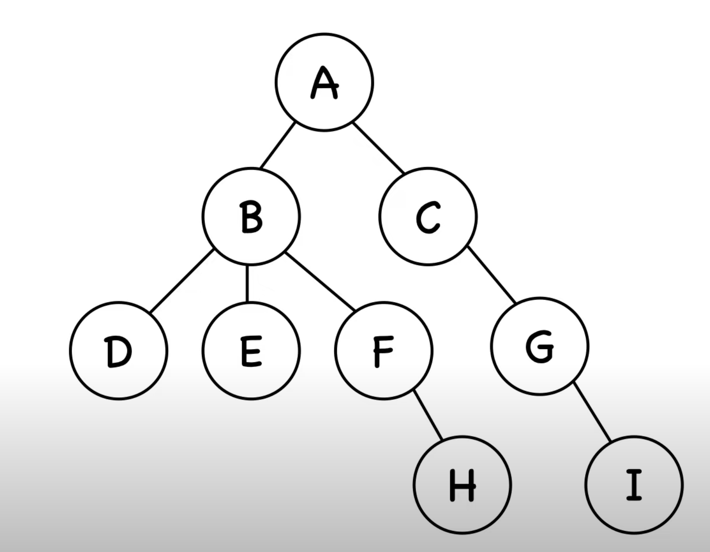

Breadth: we visit the nodes at the same level before we progress vertically

Objective: we want to know all the nodes that are discoverable, from the root node A.

Along the way we keep track of two things. Nodes that we visited. 

Nodes that are in the queue that are inline to be visited will be  

References:
- https://www.youtube.com/watch?v=HZ5YTanv5QE&ab_channel=MichaelSambol